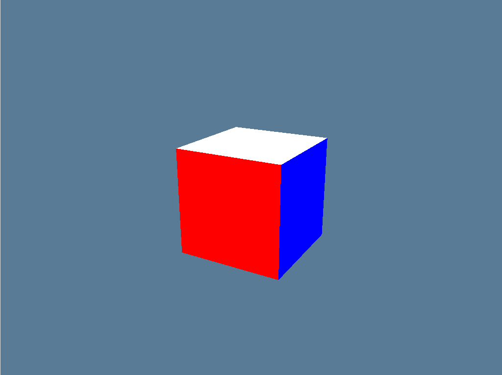
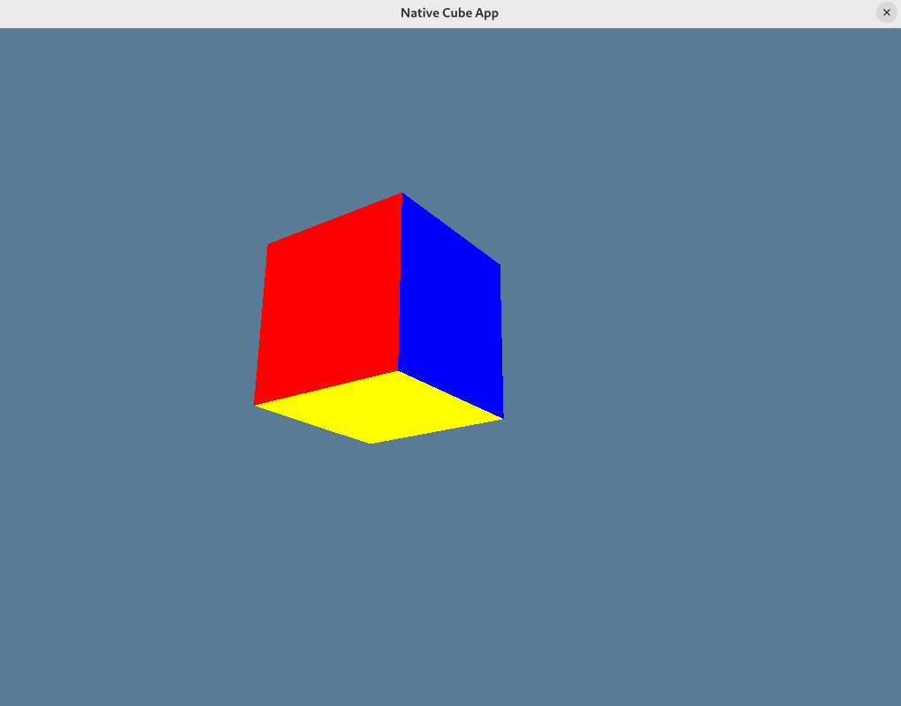

# Cube Project

A 3D cube rendering application built with Rust and WGPU. This project demonstrates real-time 3D graphics rendering for native desktop execution.

## Screenshots

Below are screenshots of the native desktop application:

**Main View:**


**Alternative View**



## Features

* Renders a colorful 3D cube.
* Interactive camera controls (WASD for movement, mouse for looking around, Space/Shift for up/down).
* Cross-platform: Runs natively on desktop (Windows, macOS, Linux).
* Built with Rust, WGPU for graphics, and Winit for windowing.

## Prerequisites

Before you begin, ensure you have the following installed:

* **Rust**: [Install Rust](https://www.rust-lang.org/tools/install) (includes `cargo`).
* On Linux, you might need to install development packages for X11 and Wayland if you don't have them already. For example, on Ubuntu/Debian:
    ```bash
    sudo apt-get update
    sudo apt-get install libgtk-3-dev libwayland-dev libxkbcommon-dev libvulkan-dev
    ```

## Getting Started

1.  **Clone the repository:**
    ```bash
    git clone https://github.com/Micronh/cube_project
    cd cube-project
    ```

### Running the Native Desktop Application

1.  **Build and run the native application:**
    ```bash
    cargo run --release
    ```
    Alternatively, to build first and then run:
    ```bash
    cargo build --release
    # The executable will be in target/release/cube_app (or cube_app.exe on Windows)
    ./target/release/cube_app
    ```

## Controls

* **W, A, S, D**: Move the camera forward, left, backward, and right.
* **Mouse Movement**: Look around.
* **Spacebar**: Move the camera up.
* **Left Shift**: Move the camera down.
* **Escape (Esc)**: Toggle mouse cursor grab/visibility.

## License

This project is licensed under the MIT License. See the `LICENSE` file for details.

## Acknowledgements

* wgpu contributors
* All other open-source libraries and tools that made this project possible.
